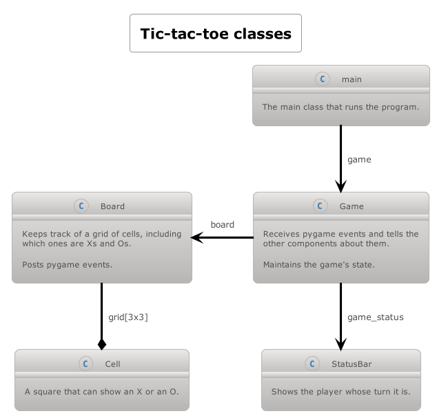

# Tic-tac-toe

This is basic tic-tac-toe game is used for teaching purposes in [Girls Who Code](https://girlswhocode.com/) sessions. 



# Preparing

```
python3 -m pip install --upgrade pip
python3 -m pip install -r requirements.txt --user
```

# Testing

```
python3 -m pytest
```

# Running

```
python3 main.py
```

# Pydoc documentation

The pydoc comments throughout the code can be reviewed in a web browser by running the following command:

```
python3 -m pydoc -b
```
