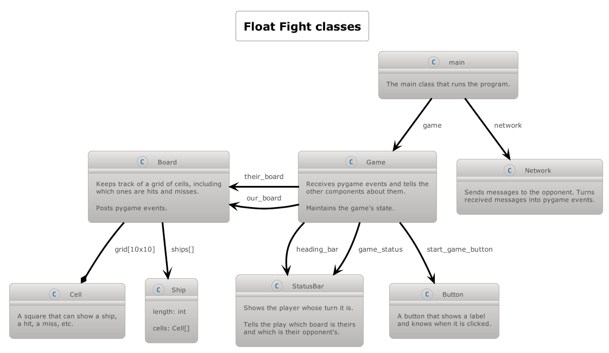

# Float Fight

This is basic game is used for teaching purposes in Girls Who Code sessions. It is for two 
players that are on the same local network. Each player positions their ships along a grid. 
Each player keeps their positions secret from the other. Then, they take turns guessing the 
coordinates of the other player's ships. The winner is the first player to discover all of 
their opponent's positions.

You and your opponent must agree on a game number between 0 and 1000. When starting up the game,
you will both provide this same number so that your instances can find each other.

The instances use multicast networking to communicate with each other. These are packets that 
everyone on a local network receives. It is even possible to run two copies of the
game on the same machine, and they will find each other.
The instances know to only respond to messages that mention either their own team name or that 
of their opponent.



# Preparing

```
python3 -m pip install --upgrade pip
python3 -m pip install -r requirements.txt
```

# Testing

```
python3 -m pytest
```

# Running

```
python3 main.py --number 401
```

If you are experimenting locally, run a second instance with the same game number.

_Note_: It is recommended to be disconnected from any VPN, that may block or redirect this network traffic.

# Pydoc documentation

The pydoc comments throughout the code can be reviewed in a web browser by running the following command:

```
python3 -m pydoc -b
```
